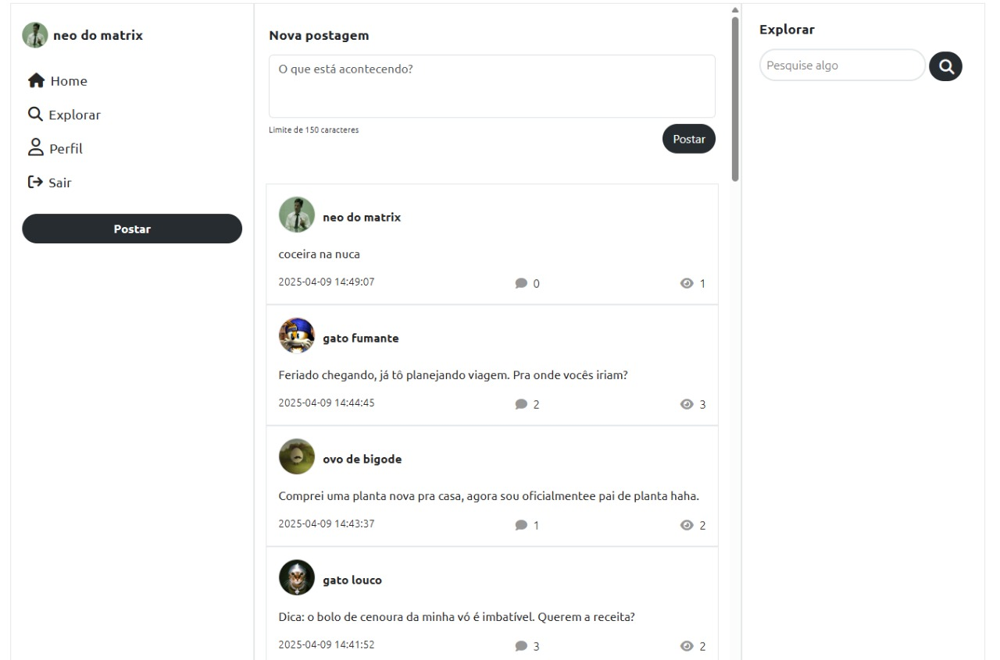
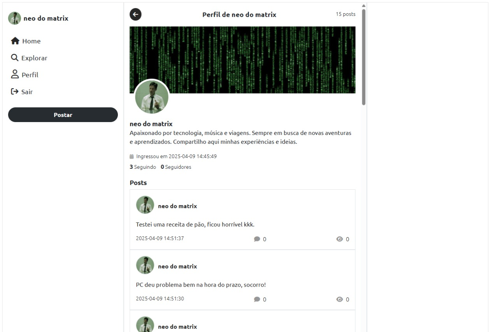
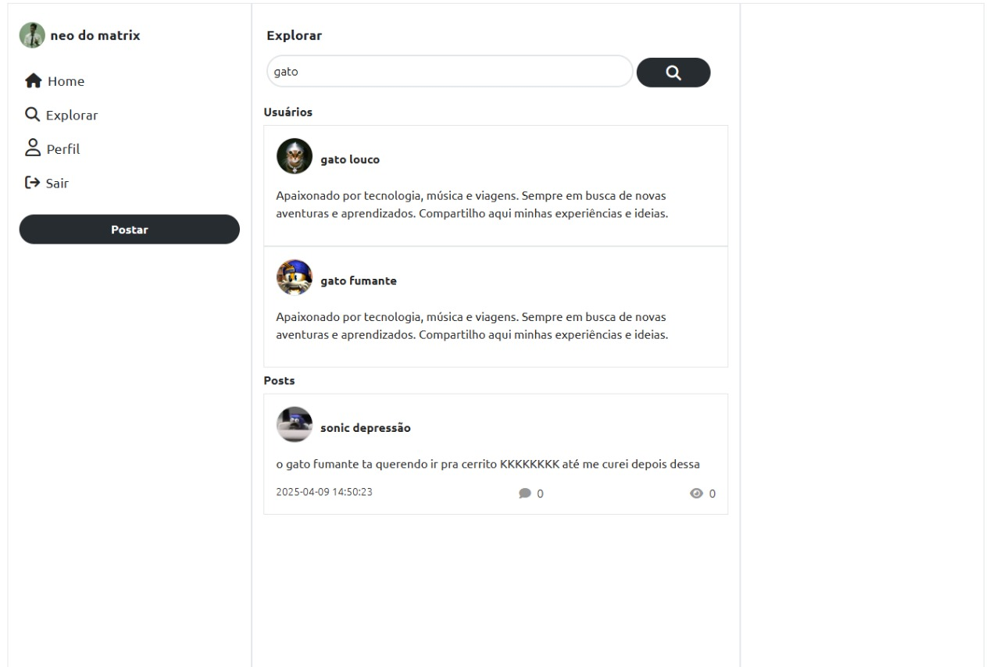
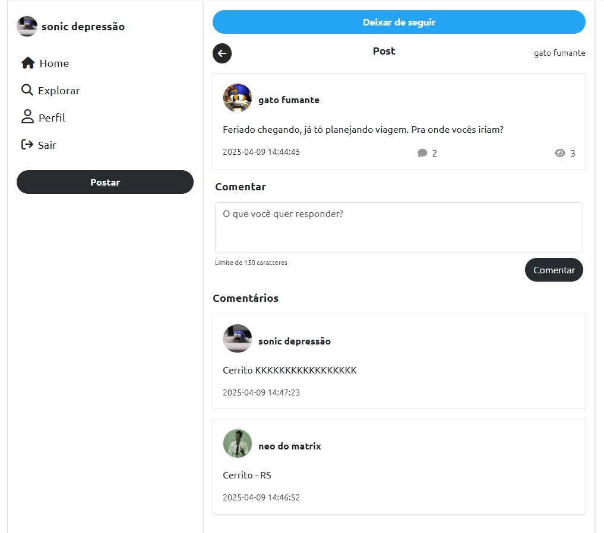
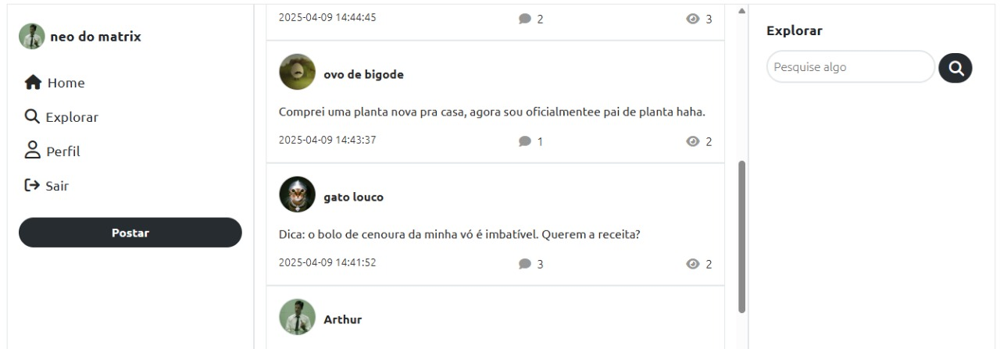
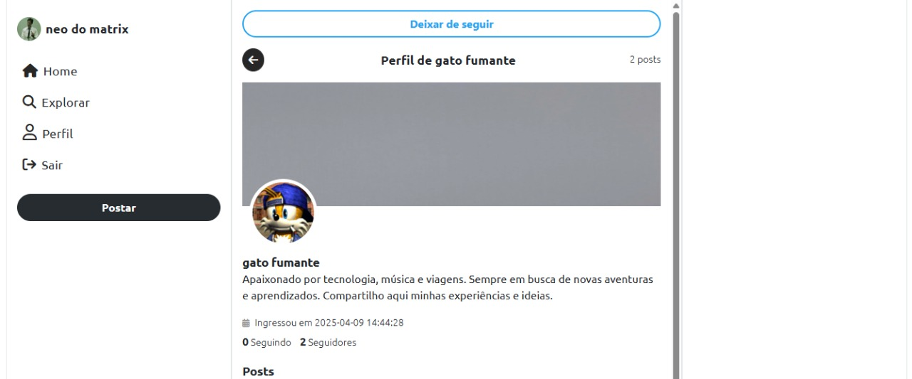
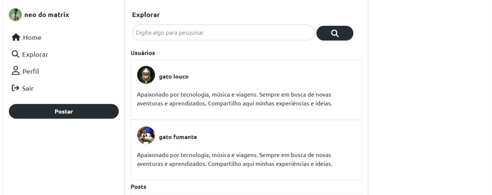

  <h1>aSocial é uma rede social simples</h1>  

  

 

  <h2>Detalhes:</h2>

  <strong>Status</strong>: Finalizado  
  <strong>Tempo em desenvolvimento</strong>: 8 dias.   

  <h2>O que foi utilizado no projeto:</h2>

<ul>
  <li>Figma (prototipagem)</li>
  <li>HTML</li>
  <li>CSS</li>
  <li>Bootstrap 5</li>
  <li>PHP</li>
  <li>PHPMyAdmin</li>
  <li>SQL</li>
  <li>Javascript</li>
</ul>

  <h2>O que o sistema faz:</h2>

<ul>
  <li>Entrega um feed com postagens de quem a pessoa segue</li>
  <li>Permite criar postagens e comentar nas postagens de outros usuários</li>
  <li>Em cada postagem mostra a quantidade de visualizações e comentários que ele teve</li>
  <li>Realiza pesquisas na aba explorar mostrando usuários e postagens relacionadas ao tema da pesquisa</li>
  <li>Possui páginas específicas para perfil de usuário e post</li>
  <li>Layout responsivo</li>
</ul>

  <h2>Melhorias:</h2>

<ul>
  <li>Aprender e implementar prepared statement para diminuir a possibilidade de SQL Injection</li>
  <li>Criar uma página de itens salvos onde o usuário possa salvar postagens</li>
  <li>O usuário poder excluir suas postagens</li>
  <li>O usuário poder editar o seu perfil (biografia, avatar e background)</li>
</ul>

  <h2>O que aprendi com este projeto:</h2>

<ul>
  <li>Validar formulários no lado do servidor e retornar os erros para o usuário mantendo os dados preenchidos no formulário</li>
  <li>Testar os meus conhecimentos por meio de consultas SQL mais complexas e planejar melhor um DB</li>
  <li>Organizar melhor os arquivos de funções PHP usando include só quando necessário para a página (e lidar com conflitos de redeclaração de funções)</li>
  <li>Utilizar JS para fazer um elemento sumir depois de determinado tempo</li>
  <li>Utilizar HTML mais semântico</li>
</ul>

  <h2>Página de perfil</h2>  

  

  <h2>Página explorar</h2>  

  

  <h2>Página de post</h2>  

  

  

  

  

  

